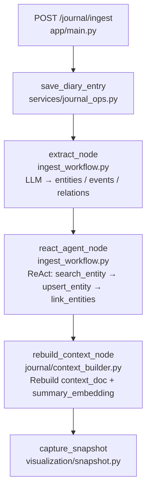
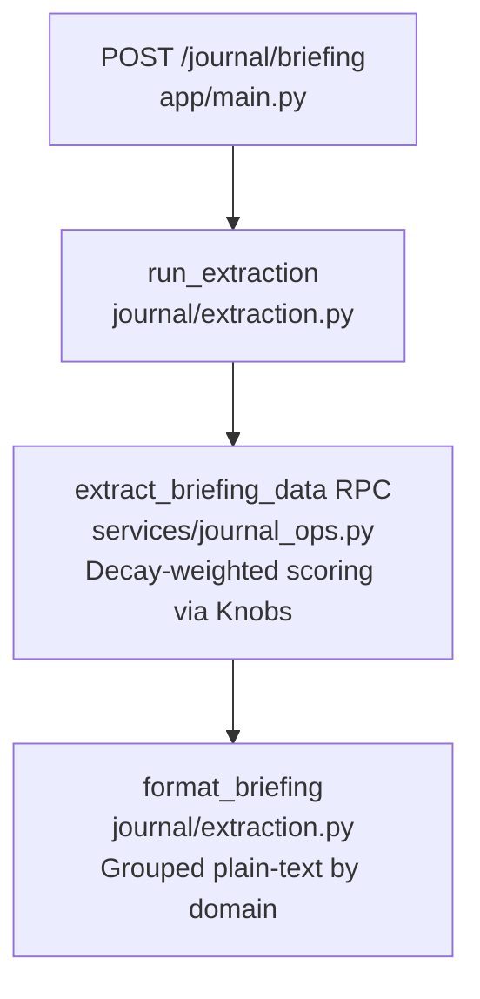
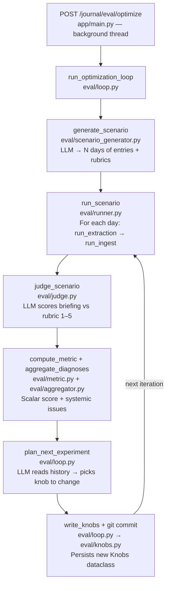

# Journal Graph RAG

A temporal knowledge graph system for personal journal entries with autonomous optimization. Extracts entities, tracks relationships over time, and generates intelligent daily briefings.

## What It Does

- **Temporal Entity Tracking**: Extracts people, goals, projects, events from journal entries
- **Decay-Weighted Graph**: Relationships fade over time, keeping briefings relevant
- **Smart Briefings**: Morning summaries of what matters today based on recency, upcoming events, and graph connections
- **Autonomous Optimization**: Self-tuning evaluation loop that improves extraction quality

## System Flow

### Write Path — Diary Ingest



### Read Path — Morning Briefing



### Autonomous Optimization Loop



### Tunable Knobs (`eval/knobs.py`)

| Group | Parameters |
|---|---|
| Scoring weights | `recency_weight`, `neighbor_weight`, `event_weight`, `freq_weight` |
| Decay rates | `edge_decay_rate`, `event_decay_rate` |
| Entity resolution | `rrf_k`, `match_count` |
| Graph traversal | `graph_depth`, `graph_hop_decay` |
| Score floor | `score_floor_multiplier` |
| Prompts | `extract_prompt`, `context_doc_prompt`, `agent_merge_rules` |

The optimization loop edits `eval/knobs.py` directly and git-commits each change. The loop calls `importlib.reload` to pick up new values mid-run without restarting the server.

## Quick Start

### 1. Setup

```bash
cd backend
uv sync                  # install all dependencies (use uv, not pip)
cp .env.example .env     # fill in Supabase URL/key and Gemini API key

# Run migrations in Supabase SQL Editor (in order):
# supabase/migrations/20260317_journal_graph_schema.sql
# supabase/migrations/20260318_parameterize_scoring.sql
# supabase/migrations/20260319_drop_old_scoring_overloads.sql
```

### 2. Run the API

```bash
cd backend
.venv/bin/python -m app.main
```

### 3. Ingest a Journal Entry

```bash
curl -X POST http://localhost:8000/journal/ingest \
  -H "Content-Type: application/json" \
  -d '{
    "user_id": "00000000-0000-0000-0000-000000000001",
    "content": "Had coffee with Sarah today. She mentioned her startup launch next week.",
    "entry_date": "2026-03-17"
  }'
```

### 4. Get Morning Briefing

```bash
curl -X POST http://localhost:8000/journal/briefing \
  -H "Content-Type: application/json" \
  -d '{"user_id": "00000000-0000-0000-0000-000000000001"}'
```

## Architecture

### Database Connection

All database access goes through **Supabase** via the PostgREST HTTP API — no direct PostgreSQL connection needed. The client is initialized once and shared across the app:

```
backend/.env
  SUPABASE_URL=https://<project>.supabase.co
  SUPABASE_SECRET_KEY=sb_secret_...
  GEMINI_API_KEY=...
```

`backend/app/services/__init__.py` creates a `supabase.Client` using these vars. `JournalOps` (`backend/app/services/journal_ops.py`) wraps all table operations (inserts, selects, RPC calls) and is instantiated as a singleton `journal_ops` imported throughout the app.

Entity resolution uses a Supabase RPC function `resolve_domain_item` that combines:
- **Vector similarity**: cosine distance on `summary_embedding` (768-dim Gemini embeddings)
- **Full-text search**: `tsvector` on title + summary + context_doc
- **RRF fusion**: Reciprocal Rank Fusion to combine both signals into a single score

> **Note**: RRF scores range ~0.01–0.05, not 0–1. Do not use them as percentage thresholds.

### Ingest Pipeline

```
extract → react_agent → rebuild_context → END
```

**`extract` node** (`extract_node`)
- One structured LLM call with `with_structured_output(ExtractionResult)`
- Outputs: list of entity mentions with type, domain, snippet, events, relations, state_change
- Model: Gemini (configured via `CHAT_MODEL` in `.env`)

**`react_agent` node** (`react_agent_node`) — the core intelligence
- A full **ReAct (Reasoning + Acting) agent** built with LangGraph's tool-calling loop
- The LLM sees all extracted entities from the journal entry and the existing graph
- It iteratively calls tools to decide per-entity: **merge into existing node or create new**
- Loop runs until the LLM produces a response with no tool calls (max 60 iterations)

Available tools (closures that capture `user_id`, `entry_date`, `diary_id` from state):

| Tool | Purpose |
|------|--------|
| `search_similar_nodes(mention, entity_type, domain)` | Calls `resolve_domain_item` RPC — returns up to 5 candidates with id, title, score, summary. **Always called first before any create.** |
| `create_node(mention, entity_type, domain, snippet)` | Creates a new `domain_items` row with `created_at=entry_date` + initial interaction |
| `update_node_interaction(item_id, snippet)` | Merges into existing node — appends a new interaction row |
| `update_lifecycle(item_id, status, note)` | Marks node `completed` or `abandoned` |
| `add_event(item_id, label, target_date, detail)` | Attaches an upcoming event to a node |
| `add_edge(source_id, target_id, relation)` | Upserts a relationship edge between two nodes |

The agent system prompt enforces: search before create, semantic title matching (not numeric score threshold), batch tool calls per entity, edges only after all nodes resolved.

**`rebuild_context` node** (`rebuild_context_node`)
- Regenerates rich `context_doc` for all stale domain items
- Embeds the doc into `summary_embedding` so future similarity searches work correctly

### Snapshot System

After every ingest, `capture_snapshot(user_id, entry_date)` saves the current graph state to `graph_snapshots`. Temporal filtering (`created_at <= entry_date`) ensures each snapshot only includes nodes that existed at that point in time — this is what makes the graph visualization grow incrementally day by day.

### Scoring

Items are ranked by a weighted combination of:
- **Recency**: exponential decay on days since last mention
- **Neighbor activity**: decay-weighted sum of connected nodes' recency
- **Event proximity**: upcoming events within a time window
- **Mention frequency**: total interaction count

All weights and decay rates are tunable via `backend/app/journal/eval/knobs.py`.

## Scripts

### `backend/reingest_all.py` — Full chronological re-ingest

Clears all derived data (domain_items, interactions, edges, events, snapshots) for a user, then re-runs the ReAct agent pipeline for every existing diary entry in date order. Use this when the pipeline changes and you want to rebuild the graph from scratch.

```bash
cd backend
.venv/bin/python reingest_all.py
# or with a specific user:
.venv/bin/python reingest_all.py --user 00000000-0000-0000-0000-000000000001
```

What it does:
1. Fetches all `diary_entries` for the user ordered by `entry_date`
2. Deletes: `domain_item_interactions`, `domain_item_edges`, `upcoming_events`, `domain_items`, `graph_snapshots`
3. For each unique date (in order), runs `ingest_app.invoke()` for each diary entry
4. Captures one snapshot per date after all entries for that date are processed
5. Prints a growth table showing items/edges/scores per snapshot

### `backend/test_integration.py` — Real end-to-end integration test

Hits actual Supabase + Gemini. Creates two diary entries for a throwaway test user and verifies entity merging works correctly.

```bash
.venv/bin/python test_integration.py           # run test
.venv/bin/python test_integration.py --cleanup  # delete test data
```

Asserts:
- Nodes created with correct `created_at` matching `entry_date`
- Recurring entities (Sarah, ML Project) are merged, not duplicated
- New entities from entry 2 are created
- Sarah accumulates 2 interactions across 2 diary entries

### `backend/app/visualization/regenerate_snapshots.py` — Snapshot-only regeneration

Rebuild snapshots from existing graph data without re-ingesting. Use when you want to recalculate scores/snapshot format but the domain_items data is already correct.

```bash
.venv/bin/python -m app.visualization.regenerate_snapshots <user_id>
```

## API Endpoints

### Journal Graph

- `POST /journal/ingest`: Ingest a journal entry (runs full ReAct pipeline)
- `POST /journal/briefing`: Get morning briefing for a user
- `GET /journal/graph/{user_id}`: Current graph state (nodes + edges)
- `GET /journal/graph/{user_id}/temporal`: Temporal graph HTML with date slider
- `POST /journal/snapshots/regenerate`: Rebuild snapshots for a user

### RAG Operations

- `POST /chat`: Self-correcting RAG agent
- `POST /search`: Direct hybrid search
- `POST /ingest`: Ingest content into RAG store

## Autonomous Optimization

The system includes a self-tuning evaluation loop that improves extraction quality by running experiments and tracking scores.

### How It Works

1. **Scenario Generation**: LLM generates a synthetic 30-day journal scenario with per-day rubrics
2. **Frozen Evaluation**: Scenario is generated once and reused across all experiments
3. **Experiment Loop** (`backend/app/journal/eval/loop.py`):
   - Commits current knobs to git
   - Ingests all 30 days with current parameters
   - LLM judge scores each day's briefing (1–5) against rubric
   - Computes mean score as the metric
   - LLM planner proposes next parameter change
   - Writes new `knobs.py` and repeats
4. **Git Tracking**: Each experiment is a commit; best configs are tagged `best-{score}`

### Tunable Parameters (`backend/app/journal/eval/knobs.py`)

**Scoring Weights**:
- `recency_weight` (default: 2.0)
- `neighbor_weight` (default: 1.0)
- `event_weight` (default: 3.0)
- `freq_weight` (default: 0.5)

**Decay Rates**:
- `edge_decay_rate`: edge/recency decay per day (default: 0.03)
- `event_decay_rate`: event proximity decay per day (default: 0.1)

**Resolution**:
- `entity_resolve_threshold`: minimum RRF score to consider a candidate (default: 0.02)
- `rrf_k`: RRF fusion constant (default: 60)

### Phase 1: Setup

```bash
# Generate a 30-day synthetic scenario (done once, reused across experiments)
curl -X POST http://localhost:8000/journal/eval/generate \
  -H "Content-Type: application/json" \
  -d '{"archetype": "college_student", "num_days": 30}'
```

### Phase 2: Run the Loop

```bash
# Run N optimization iterations
curl -X POST http://localhost:8000/journal/eval/run \
  -H "Content-Type: application/json" \
  -d '{"user_id": "00000000-0000-0000-0000-000000000001", "iterations": 10}'
```

Each iteration:
1. Create fresh test user (UUID)
2. Run 30-day scenario:
   - Each morning: extract briefing with current knobs
   - Each evening: ingest journal entry
3. LLM judge scores each day's briefing (1-5 scale)
4. Compute mean score across 30 days
5. Log to results.tsv
6. If best score: git tag `best-{score}`
7. LLM planner reads program.md + results.tsv
8. Proposes next parameter change
9. Write new knobs.py

### Phase 3: Analysis

```bash
# View all experiments
cat backend/app/journal/eval/results.tsv

# Restore best configuration
git checkout best-4.350

# Or manually edit knobs.py based on insights
```

### What Gets Optimized

The judge evaluates each day's briefing against the rubric:
- **Coverage**: Did it surface expected entities/events?
- **Precision**: Did it avoid stale/irrelevant items?
- **Insight**: Did it make useful connections?

The metric is simply: `mean(judge_scores)` across all 30 days.

### Example Optimization Run

```
Iteration 0: score=3.2 (defaults)
Iteration 1: event_weight=4.0 → score=3.5 (better event coverage)
Iteration 2: edge_decay_rate=0.05 → score=3.8 (fewer stale items)
Iteration 3: score_floor_multiplier=0.15 → score=4.1 (cleaner briefings)
...
Iteration 9: best score=4.3
```

## Project Structure

```
├── backend/
│   ├── app/
│   │   ├── core/                    # Shared LLM/embeddings providers
│   │   │   ├── providers.py         # get_llm(), get_embeddings() singletons
│   │   │   └── gemini_embeddings.py # Gemini embedding wrapper
│   │   ├── services/
│   │   │   └── journal_ops.py       # All DB operations (JournalOps singleton)
│   │   ├── journal/
│   │   │   ├── ingest_workflow.py   # ReAct agent pipeline (extract→react_agent→rebuild_context)
│   │   │   ├── prompts.py           # EXTRACT_PROMPT, REACT_AGENT_SYSTEM_PROMPT, CONTEXT_DOC_PROMPT
│   │   │   ├── context_builder.py   # Rebuilds context_doc + summary_embedding for nodes
│   │   │   ├── scoring.py           # Decay-weighted scoring
│   │   │   ├── state.py             # IngestState TypedDict
│   │   │   └── eval/                # Autonomous optimization loop
│   │   │       ├── loop.py          # Main experiment loop
│   │   │       ├── knobs.py         # Tunable parameters
│   │   │       ├── scenario_generator.py  # LLM-generated test scenarios
│   │   │       ├── judge.py         # LLM judge for briefing quality
│   │   │       └── runner.py        # Per-iteration ingest + eval runner
│   │   └── visualization/
│   │       ├── snapshot.py          # capture_snapshot() — temporal graph capture
│   │       └── regenerate_snapshots.py  # CLI: rebuild snapshots from existing data
│   ├── reingest_all.py              # CLI: clear derived tables + re-ingest chronologically
│   ├── test_integration.py          # Real Supabase integration test
│   └── tests/
│       └── test_react_agent.py      # Unit tests for ReAct agent node
└── supabase/
    └── migrations/                  # SQL schema + RPC functions
```

## License

MIT